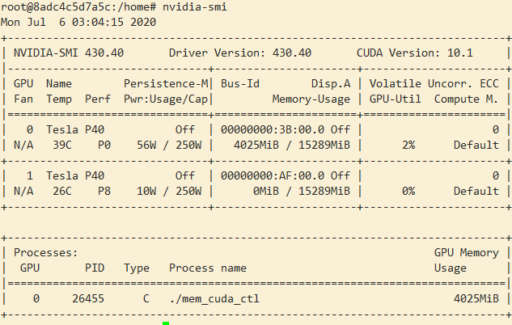

# nvidia-smi-opt
The improved nvidia-smi command implementation which can display the process pid in container or pod.

The usage:
1. copy the libnvidia_opti.so to the contianer/pod's path:  /usr/local/lib/ 
2. export LD_PRELOAD=/usr/local/lib/libnvidia_opti.so 

After lanuching your gpu process, you can use nvidia-smi to check the process like below：

